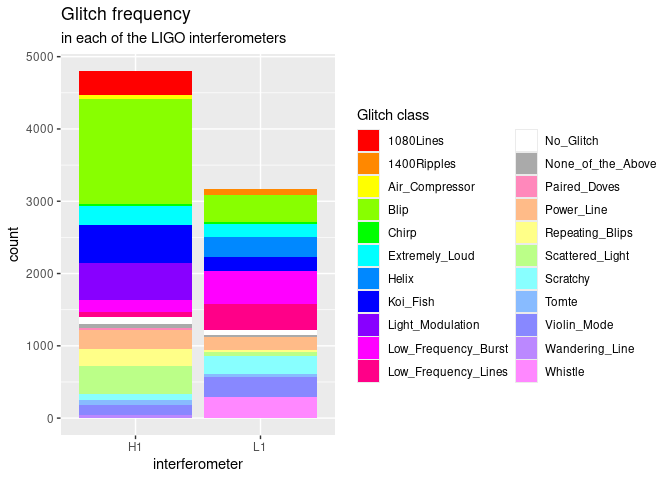
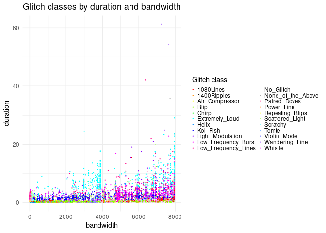
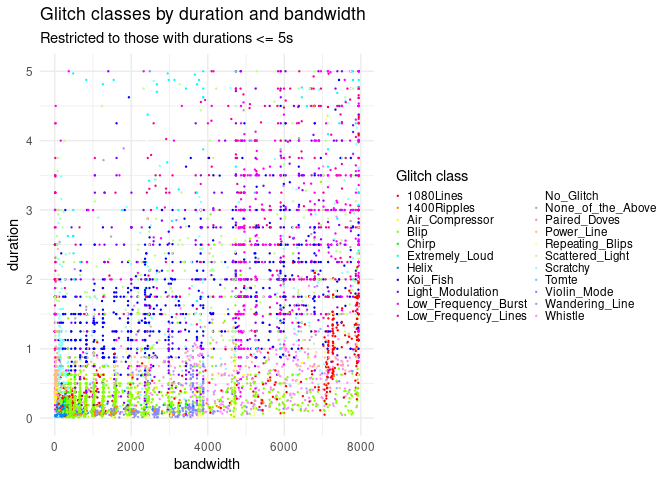
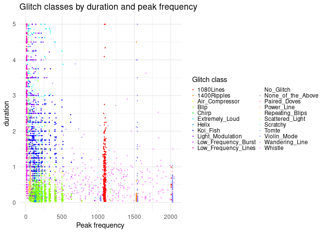
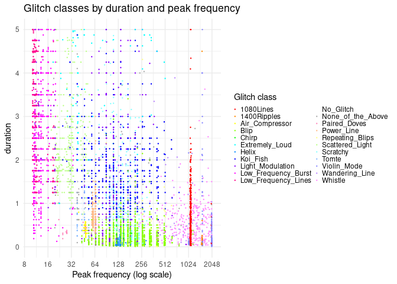
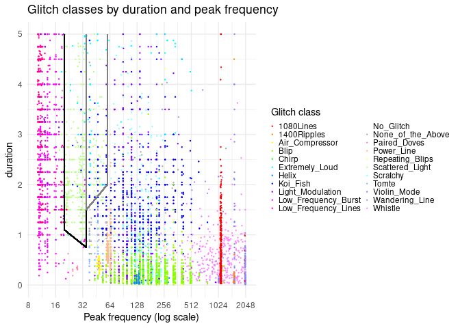
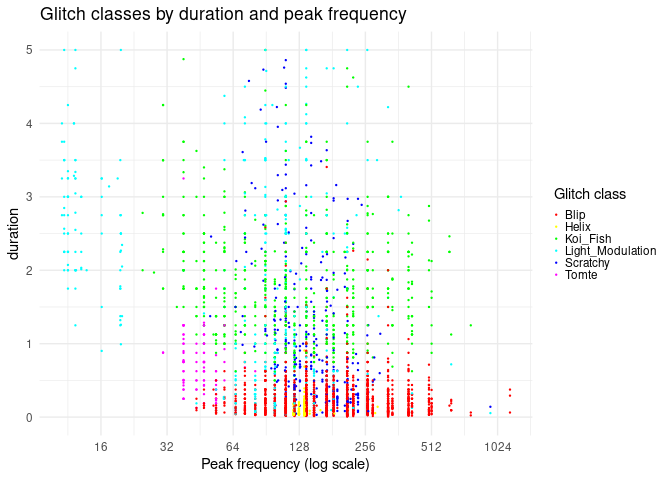
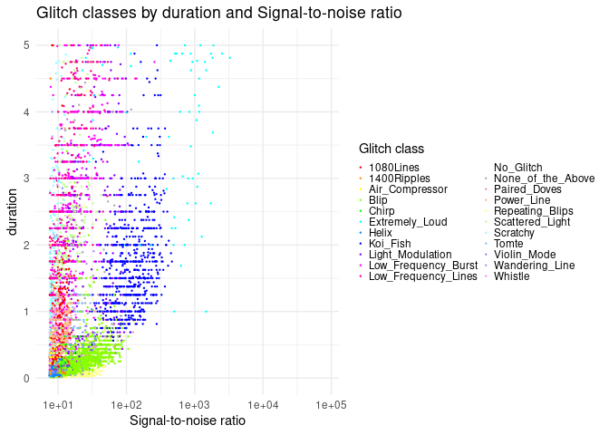
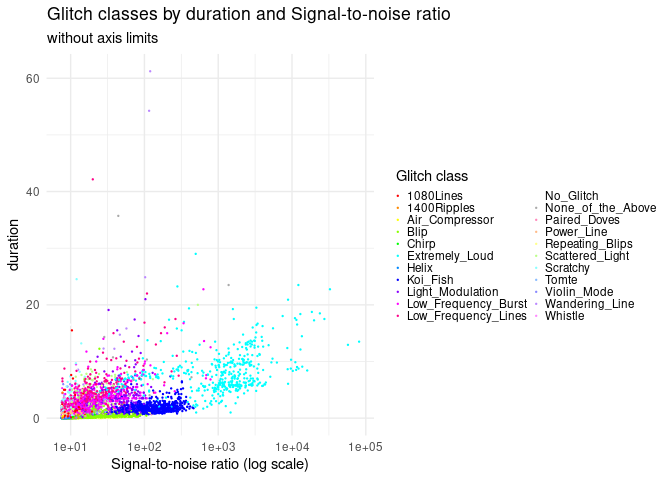
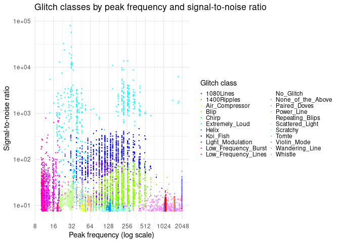

Analysis of data
================
Micaiah Balonek

To start our preliminary analysis of the data, we plot how common each
of these glitches are compared to eachother in each interferometer:

<!-- -->

First of all, we can see that several glitch classes are specific to
each interferometer (although some may just have few enough examples
that they don’t show up in this graph). Another interesting thing to see
is that Hanford generally has more glitches than Livingston, and that
Blips, Koi Fish, and Low-Frequency Bursts appear to be the glitches with
the most examples. To see whether this is accurate, we will now
calculate summary statistics for each glitch class. The following
summary statistics include the number of glitches of that class detected
in each interferometer (columns `n_H1` and `n_L1`) and the means of each
of the predictor variables for each class.

    ## # A tibble: 22 × 8
    ##    label             n_H1  n_L1    snr peak_freq central_freq duration bandwidth
    ##    <chr>            <dbl> <dbl>  <dbl>     <dbl>        <dbl>    <dbl>     <dbl>
    ##  1 1080Lines          327     1   10.2      1111         2961     0.85      4730
    ##  2 1400Ripples          0    81   10.9      1527         1846     0.15      1654
    ##  3 Air_Compressor      55     3    8.7        48          320     0.41       567
    ##  4 Blip              1453   368   22.8       199          839     0.27      1595
    ##  5 Chirp               28    32   13.6       141          264     0.29       461
    ##  6 Extremely_Loud     266   181 2416.        140         2673     8.17      5311
    ##  7 Helix                3   276    8.8       134          263     0.09       326
    ##  8 Koi_Fish           517   189  139.        157         1834     1.75      3629
    ##  9 Light_Modulation   511     1   34.6       105         2000     2.34      3966
    ## 10 Low_Frequency_B…   166   455   29.9        16         2611     2.91      5208
    ## 11 Low_Frequency_L…    79   368   23.1        12         2630     3.94      5243
    ## 12 No_Glitch           91    59    9.3       183         1601     1.95      2915
    ## 13 None_of_the_Abo…    51    30   45.3       170         1744     2.72      3436
    ## 14 Paired_Doves        27     0   33.4        41         1270     0.42      2505
    ## 15 Power_Line         273   176   11.3        62          733     0.75      1367
    ## 16 Repeating_Blips    230    33   29.2       200         1650     0.31      3214
    ## 17 Scattered_Light    385    58   16.4        30         2175     2.61      4319
    ## 18 Scratchy            90   247    8.6       153         1223     1.45      2269
    ## 19 Tomte               61    42   16.2        47          833     0.73      1622
    ## 20 Violin_Mode        141   271   13.4      1673         1742     0.29      2637
    ## 21 Wandering_Line      42     0   27.8       667         2127     6.05      3929
    ## 22 Whistle              2   297    9.5      1093         2690     0.59      4788

From this summary data, we can see that the Machine Learning system has
classed several glitches into categories from the “wrong” observeratory.
This can be explained in the following way: enough glitches happen that
even if a certain glitch type isn’t present in one interferometer, a
burst of noise can appear with a random shape that the ML couldn’t
classify well into the “correct” interferometer’s categories, and which
happens to look like a glitch from another category, and would get
classified into that; alternatively, since “None of the Above” is a
category, this implies that the training data (classified by citizen
scientists) is included in this dataset, and these mistakes were human
errors, already present in the training data. We can also see that Koi
Fish, one of the most prominent types of glitches, is also the loudest
standard class (other than Extremely Loud glitches, which are the
loudest by definition), while Scratchy, Helix, and Air Compressor
glitches are the quietest, even quieter on average than the ‘No glitch’
category.

### Preliminary Analysis

To begin our analysis of the data points themselves (other than just the
averages for each glitch class) we plot out `bandwidth` by `duration`,
with the colour of the points representing the label, to see how well we
can group glitch classes by the general dimensions of the signal:

<!-- -->

This image is a bit hard to read, since the labels take up so much room,
and since there are so many data points on the graph; still, one can
tell that in the lower part of the distribution the glitch population is
dominated by the blue and purple colours of Koi Fish, Low-Frequency
Bursts, and Low-Frequency Lines, with a sudden stripe of green (and
assorted other colours) at the very bottom. Zooming in on the y-axis to
glitches with durations less than 5 seconds gives us the following plot:

<!-- -->

With this zoomed-in visualisation, we can see that the data has some
artefacts, causing the values to line up on a grid; ignoring this,
however, we notice the large cluster of green “Blip”-type glitches at
the bottom, especially prominent in the bottom-left corner, as well as
two major populations of 1080-Lines: one forming linear patterns in the
lower-right-hand corner of the distribution, and the other one being
around the left-hand side of the blip distribution. We also see a
population of either violin modes or wandering lines in the center of
the lower edge of the plot, its density peaking at bandwidths between
3000 and 4000. We also now see that there are many Koi Fish glitches
spread through the background distribution, which we mixed in with the
colour of the low-frequency bursts and lines in our earlier analysis.
The last notable point that stands out in this graph is the fact that
Koi fish and Low Frequency Bursts seem to dominate for most of the
chart, with assorted scattered-light glitches among them as well.

Meanwhile, if we instead plot peak frequency by duration (using the same
limit on duration), we get the following graph:

<!-- -->

Here, we can clearly see spikes of 1080-Hz lines and 1400-Hz ripples at
their respective frequencies, as well as several spikes of violin modes
at frequencies just over 1000Hz, 1500Hz, and 2000Hz, among a background
composed mostly of Whistles. Moving into lower frequencies, we see a
cloud of Blips underneath another blob, mostly composed of Koi Fish.
There are several distributions of other glitches at lower frequencies
as well, but these are harder to see clearly because of how little room
they take up on the graph; to solve this, we use the same transformation
as the Gravity Spy spectrograms do: taking the logarithm of the
frequency values.

<!-- -->

In this new graph, while we can still see the high-frequency spikes, we
can now also see many lower-frequency trends (as well as similar
gridline textures as in the previous diagrams). One of the most
striking, in my opinion, is the line at 20Hz that seperates the low
frequency lines and bursts from the scattered light glitches. There is a
similar line on the other side of the scattered light glitches which
seperates them from most other glitches (although there is a small area
outside this line where there are scattered lights mixed with other
glitch types, surprisingly enough still bounded by vertical lines). I
have outlined these areas in the following plot:

<!-- -->

Moving back to the unmarked graph, we can see the 60Hz Power Line
glitches as a line of orange-coloured points around the 60Hz-line, and
the Air Compressor glitches as a similar, yellow line at around 45Hz. We
also see that in this graph, blips are mostly found in a triangle from
40Hz to 700Hz, and with durations less than 1 second, with a cluster of
Helixes in the center. The area above this triangle has a background
patterned with the dark blues of Koi Fish and Light Modulation, the cyan
colour of Scratchy glitches, and the pale blue of Tomtes. Restricting
our graph to these types of glitches to get a better look at their
distributions, we get the following graph:

<!-- -->

Here, we can tell that Light Modulation has data points all across the
graph, from around (1000, 0) to around (11, 5), while Tomtes are fairly
localised between (32, 0) and (64, 1.3), with few exceptions. Helices
are indeed clustered in the center of the Blip cluster, which is in most
cases visibly seperate from the Koi Fish cluster, with Scratchy glitches
being found throughout both of these.

Next, we plot out `SNR` by each of `duration` and `peak frequency`, and
analyse the results of these graphs:

<!-- --><!-- --><!-- -->

From the first plot, we can see that, while blips, koi fish, and
Extremely Loud glitches form visually distinct categories, most of the
other glitch classes are in the same region as eachother. The second
plot (which is basically just a zoomed-out version of the first plot)
emphasises these four distributions, while also showing a notable second
group of Extremely Loud glitches that intersect the ‘other’
distribution. The third plot, however, is arguably the easiest graph to
tell the different glitch classes apart on so far, with scratchy having
a nearly-distinct region (although slightly overlapping with Helix and
Blips), as well as Scattered Light (which has the most overlap with
Tomtes, surprisingly) and most of the clusters from the
`peak frequency`-`duration` plot, although seeming to mix up the other
low-frequency glitches more than the original graph.
