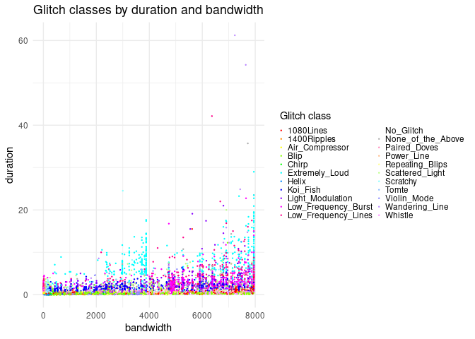

Project proposal
================
Micaiah Balonek

## 1. Introduction

In this project, we are analysing data from the LIGO detectors;
specifically, we are looking at the waveforms corresponding to glitches
in these detectors, classified into categories by a machine learning
system trained on the responses of citizen scientists in the Gravity Spy
project.

This dataset contains the metadata connected to each glitch, along with
the glitch class that it was classified into; each glitch can be
visualised on a spectrogram as a shape in the three-dimensional
time-amplitude-frequency space, which is what the machine learning
classifies it based on. The data includes four of these spectrograms for
each glitch, identical except for what length of time they represent, in
the format of the Gravity Spy project. The data therefore includes
variables such as the peak and central frequencies, the bandwidths,
phase, and the duration of these glitches, but also provides a few
measures of the strength of the glitch: not only the simple amplitude
value, but also the signal-to-noise ratio (SNR) of each signal and the
gravity spy ID number. Many columns were also provided which were
entirely filled with one value, which I have decided to leave out of the
descriptions, since they are of no consequence to the rest of the data.
The URLs will also not be necessary, unless we want to look at the
spectrograms for some reason (possibly as an example of a class, or a
test of some classification schema). As an example, this is how Gravity
Spy spectrograms appear: 

 Unlike most Gravity Spy subjects, this is not a glitch, but a
“chirp”, either a real gravitational wave or one simulated by the LIGO
staff. 

Here we will be analysing the different classes of glitches according to
the different to attempt to see if we can find a combination of the
other parameters (`bandwidth`, `peak` and `central` frequencies,
`duration`, and `snr`) which can provide splits which approximate the
machine learning’s classification scheme.

## 2. Data

Here, we load the data from the .csv file in the data folder into R as
the `gravity_spy_metadata` dataframe, and remove several columns that
have no use in any analysis of this data.

    ## Rows: 7,966
    ## Columns: 21
    ## $ event_time     <dbl> 1134216193, 1129359782, 1127425469, 1132636755, 1132035…
    ## $ ifo            <chr> "L1", "L1", "L1", "L1", "L1", "H1", "L1", "L1", "L1", "…
    ## $ peak_time      <dbl> 1134216192, 1129359781, 1127425468, 1132636755, 1132035…
    ## $ peak_time_ns   <dbl> 931639909, 558593034, 976317882, 365233898, 197264909, …
    ## $ start_time     <dbl> 1134216192, 1129359781, 1127425468, 1132636754, 1132035…
    ## $ start_time_ns  <dbl> 832031011, 47851085, 960937023, 951172113, 933837890, 4…
    ## $ duration       <dbl> 0.18750, 0.94238, 0.04688, 0.82422, 2.00366, 0.38281, 0…
    ## $ event_id       <dbl> 21, 107, 218, 88, 16, 228, 78, 0, 92, 84, 10, 56, 59, 7…
    ## $ peak_frequency <dbl> 1337.6953, 654.7477, 1337.8275, 1182.9746, 1456.5114, 1…
    ## $ central_freq   <dbl> 1120.0432, 1823.0734, 2024.1775, 3981.7747, 3979.0269, …
    ## $ bandwidth      <dbl> 573.36395, 3426.57642, 3778.70190, 7492.71777, 7942.912…
    ## $ amplitude      <dbl> 1.19765e-22, 8.25585e-23, 9.76294e-22, 1.46212e-22, 4.0…
    ## $ snr            <dbl> 7.51139, 9.63013, 15.37104, 10.32116, 14.38016, 8.48089…
    ## $ gravityspy_id  <chr> "zmIdpucyOG", "zWFRqqDxwv", "zKCTakFVcf", "z14BdoiFZS",…
    ## $ label          <chr> "Whistle", "Whistle", "Whistle", "Whistle", "Whistle", …
    ## $ sample_type    <chr> "train", "test", "train", "validation", "validation", "…
    ## $ url1           <chr> "https://panoptes-uploads.zooniverse.org/production/sub…
    ## $ url2           <chr> "https://panoptes-uploads.zooniverse.org/production/sub…
    ## $ url3           <chr> "https://panoptes-uploads.zooniverse.org/production/sub…
    ## $ url4           <chr> "https://panoptes-uploads.zooniverse.org/production/sub…
    ## $ phase          <dbl> -2.72902, 1.10682, -0.83099, 0.76242, -0.31161, 1.56686…

## 3. Data analysis plan

Our predictor variables are `bandwidth`, `peak frequency`,
`central frequency`, `duration`, and `snr`, while our outcome variable
will be some approximation to the grouping system of `label` (an
approximation, because we probably won’t be able to replicate the
categories exactly, only approximately).

### Data summary

To start our preliminary analysis of the data, we plot how common each
of these glitches are compared to eachother in each interferometer:

<!-- -->

First of all, we can see that several glitch classes are specific to
each interferometer (although some may just have few enough examples
that they don’t show up in this graph). Another interesting thing to see
is that Hanford generally has more glitches than Livingston, and that
Blips, Koi Fish, and Low-Frequency Bursts appear to be the glitches with
the most examples. To see whether this is accurate, we will now
calculate summary statistics for each glitch class. The following
summary statistics include the number of glitches of that class detected
in each interferometer (columns `n_H1` and `n_L1`) and the means of each
of the predictor variables for each class.

    ## # A tibble: 22 × 8
    ##    label             n_H1  n_L1    snr peak_freq central_freq duration bandwidth
    ##    <chr>            <dbl> <dbl>  <dbl>     <dbl>        <dbl>    <dbl>     <dbl>
    ##  1 1080Lines          327     1   10.2      1111         2961     0.85      4730
    ##  2 1400Ripples          0    81   10.9      1527         1846     0.15      1654
    ##  3 Air_Compressor      55     3    8.7        48          320     0.41       567
    ##  4 Blip              1453   368   22.8       199          839     0.27      1595
    ##  5 Chirp               28    32   13.6       141          264     0.29       461
    ##  6 Extremely_Loud     266   181 2416.        140         2673     8.17      5311
    ##  7 Helix                3   276    8.8       134          263     0.09       326
    ##  8 Koi_Fish           517   189  139.        157         1834     1.75      3629
    ##  9 Light_Modulation   511     1   34.6       105         2000     2.34      3966
    ## 10 Low_Frequency_B…   166   455   29.9        16         2611     2.91      5208
    ## 11 Low_Frequency_L…    79   368   23.1        12         2630     3.94      5243
    ## 12 No_Glitch           91    59    9.3       183         1601     1.95      2915
    ## 13 None_of_the_Abo…    51    30   45.3       170         1744     2.72      3436
    ## 14 Paired_Doves        27     0   33.4        41         1270     0.42      2505
    ## 15 Power_Line         273   176   11.3        62          733     0.75      1367
    ## 16 Repeating_Blips    230    33   29.2       200         1650     0.31      3214
    ## 17 Scattered_Light    385    58   16.4        30         2175     2.61      4319
    ## 18 Scratchy            90   247    8.6       153         1223     1.45      2269
    ## 19 Tomte               61    42   16.2        47          833     0.73      1622
    ## 20 Violin_Mode        141   271   13.4      1673         1742     0.29      2637
    ## 21 Wandering_Line      42     0   27.8       667         2127     6.05      3929
    ## 22 Whistle              2   297    9.5      1093         2690     0.59      4788

In the next plot of our preliminary analysis, we plot out `bandwidth` by
`duration`, with the colour of the points representing the label, to see
how well we can group glitch classes by the general dimensions of the
signal:

<!-- -->

This image is a bit hard to read, since there are so many data points on
the graph and they are nearly all in the lower section of the graph;
still, one can see that in the lower part of the distribution the glitch
population is dominated by the colours of Koi Fish and Low-Frequency
Bursts, except for a stripe of blips (and assorted other glitches) at
the very bottom.

### Methods

To find a good predictor of the glitch class, I think a good approach
would be to start by finding a simple way to divide the space of all
glitches into smaller groups of glitch classes, and then doing the same
to these groups as well until we have groups that represent (fairly
well) one glitch class each. To do this, a good strategy would be to
start by plotting graphs of each variable against the others, and then
looking for the simplest useful way to divide the data. However, this
might not work well for some glitch classes, such as light modulation,
which would be hard to create a single classification for, since they
appear looking like a Blip followed by a Low-Frequency Burst, making
them harder to classify well, in which case, it may be impossible to
separate them from other glitches, since this dataset doesn’t represent
the data surrounding the glitches, only the data of the glitces
themselves.
